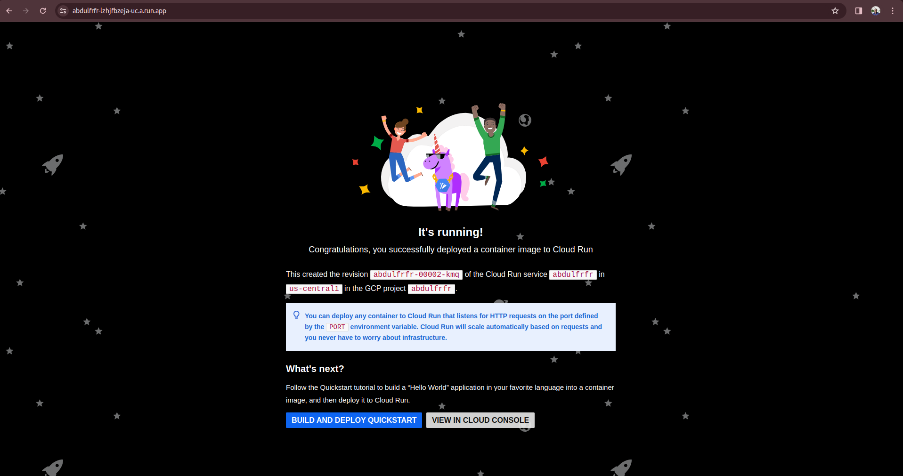

In this project the Google cloud services used were, Google Run, Google Build and Google Artifact Registery

1. First of all a container registry was created on `Artifact Registry` which was meant to hold the pushed container image which will be pushed to it

2. Secondly, a Google Run service was created to run our container

3. Thridly a Build trigger from Google Build service was created to trigger the build `cloudbuild.yaml` file which was in my github reprository.

Below i will be explaining the steps which was followed in other to get to a successful deployment of the container;

Upon creating the `Artifact Registery`, `Google Run` and `Google Build` services, i went ahead to create a triger to pull the `cloudbuild.yaml` file from my github using the GitHub App authentication process, i was also able to configure some environmental variables in the trigger section of the `Cloud Build` service to be used in the `cloudbuild.yaml` file when pulling the `cloudbuild.yaml` file from my github repro for more secrecy;

After doing that, it was necessary for me to enable some APIs for this service to give the required result, below are the list of enabled API;

After that i went ahead to run my trigger which was successful and i also went ahead to check out the logs of the build process which is shown below;

Now i went back to the `Cloud Run` service i created to check if the container was deployed and running, which was obviously running and i was able to copy the link of the application to and run it on a different browser window;

